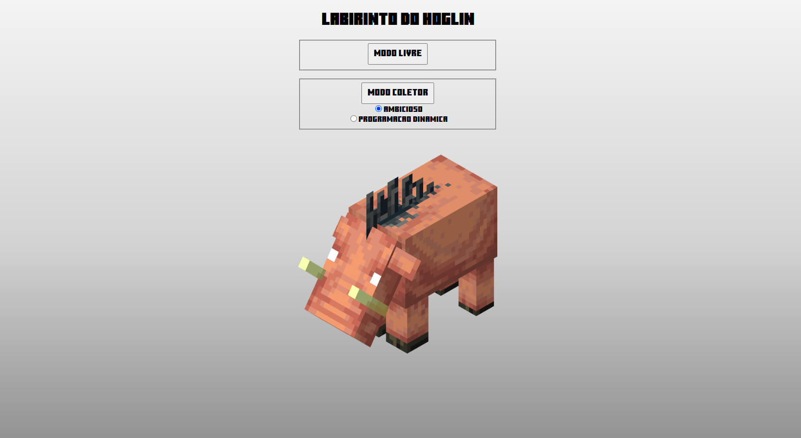
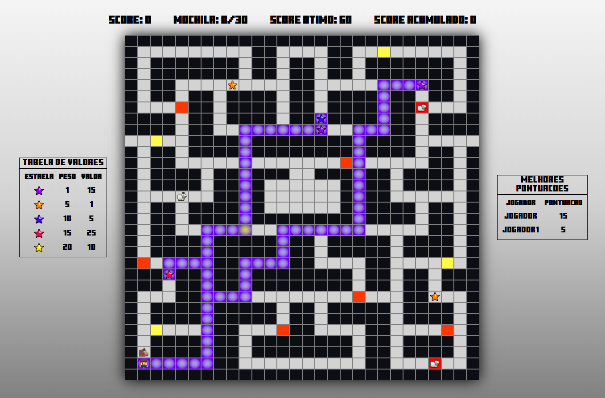
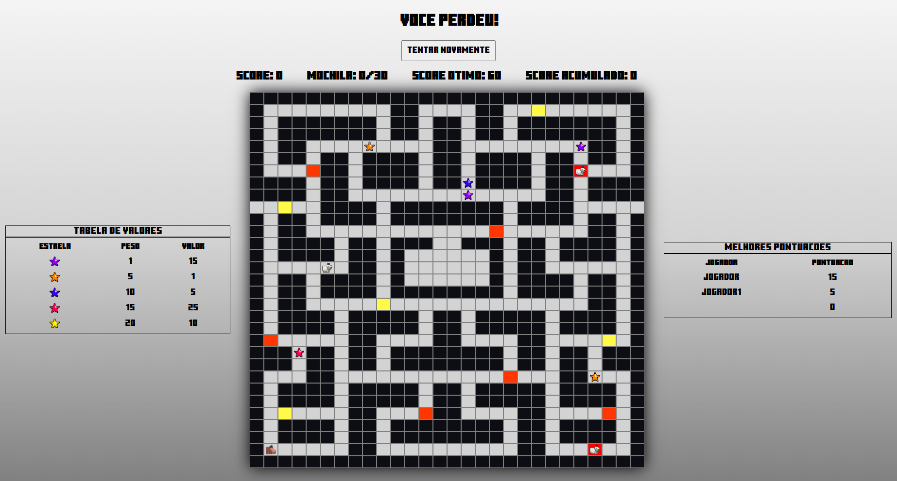

# Labirinto Do Hoglin

**Número da Lista**: 20 
**Conteúdo da Disciplina**: Final 

## Alunos

| Matrícula  | Aluno                   |
| ---------- | ----------------------- |
| 19/0025379 | Brenno Oliveira Silva   |
| 19/0020377 | Thiago Sampaio de Paiva |

## Sobre

O labirinto do Hoglin dessa entrega consiste numa evolução do trabalho de [Greed](https://github.com/projeto-de-algoritmos/Greed_LabirintoDoHoglin), adicionando novos algoritmos que auxiliam o jogador. O algoritimo de Bellman-Ford foi utilizado para gerar o caminho até as estrelas ótimas quando o jogador pausa o jogo 'P'. Além disso, também foi adicionada a versão do Knapsack de programação dinâmica.

## Screenshots

## Apresentação

[Video da Apresentação](assets/apresentacao.mp4)

## Instalação

**Linguagem**: Javascript 
**Pré-requisitos**: Navegador Web

## Uso

Para utilizar o projeto acesse: https://final-labirinto-do-hoglin.herokuapp.com/ ou abra o arquivo ´index.html´ no navegador web de sua preferência
